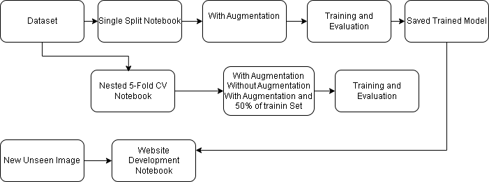

# A Skin Disease Identification Using CNNs for Childcare Applications

This repository contains the supplementary code and workflow for the manuscript:

**Title:** A website-based skin disease identification using a Convolution Neural Network for childcare applications

**Author(s):** Shehab Alzaeemi, Kim Gaik Tay, Ghassan Ahmed Ali, Adnan Ameen Abdullah Bakather, Audrey Huong, Muhammad Hakimi Ashraf Bin Mohd Thulhah, Ren Yu Lai

**Year:** 2025

## Project Overview

The project focuses on classifying skin disease images into four classes using transfer learning with the InceptionV3 pretrained convolutional neural network (CNN). It includes a comparison between a single data split with a ratio of 0.8:0.1:0.1 and a nested 5-fold cross-validation approach.

This code is provided to enhance transparency and reproducibility in response to reviewer comments.

## 📁 Repository Structure
```
skin-disease-identification/
├── README.md
├── LICENSE
├── requirements.txt
├── figures/
│ └── Skin.drawio.png
└── notebooks/
  ├── single_split.ipynb
  └── nested_5fold.ipynb

## 📁 Dataset Structure

The dataset used in this study **cannot be publicly released** due to copyright and privacy restrictions.

However, the code is compatible with any dataset following the structure below:
dataset/
├── train/
│ ├── class1/
│ ├── class2/
│ ├── class3/
│ └── class4/
├── val/
│ ├── class1/
│ ├── class2/
│ ├── class3/
│ └── class4/
└── test/
├── class1/
├── class2/
├── class3/
└── class4/
text

## 💾 Model and Web Deployment Notes

**Trained Model Weights:** The final trained model weights have been excluded from this repository as they exceed GitHub's maximum file size limit (25MB).

**Web Application (web.py):** The code for the Gradio-based demonstration interface has been omitted. This decision was made to maintain a streamlined repository focused on the core research scripts, as the web application requires large external dependencies (like TensorFlow) and the excluded model file.

## 🌐 Workflow Diagram

The conceptual workflow of the project is shown below:



## ⚙️ Installation and Usage

1. Clone the repository:
```bash
git clone https://github.com/taykimgaik/skin-disease-identification.git
cd skin-disease-identification/notebooks
2.	Install dependencies:
bash
pip install -r requirements.txt
3.	Run the notebooks in Jupyter or Google Colab.
## 📄 Citation
If you use this code in your research, please cite our paper (citation details will be added upon publication).
## 📧 Contact
For questions about this repository, please contact tay@uthm.edu.my.
## 📜 License
This project is licensed under the MIT License - see the LICENSE file for details.

